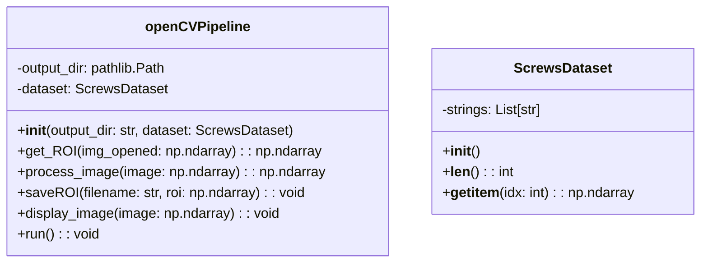
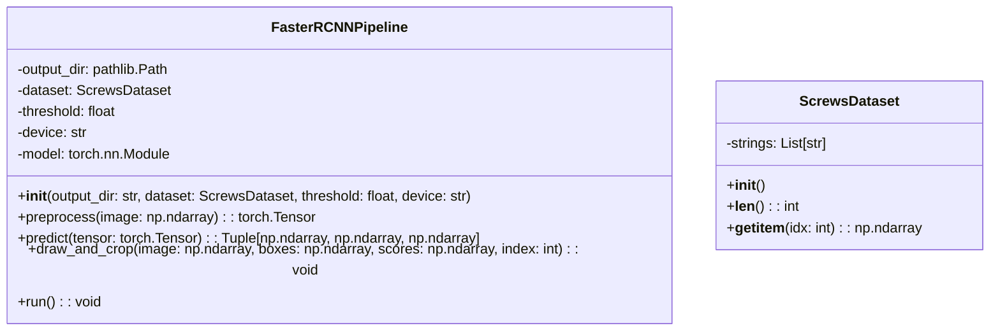

# Industrial Computer Vision - Screw Detection Solution

## Project Overview

This project implements two distinct approaches for detecting and isolating industrial screws in images: a traditional computer vision approach using OpenCV and a deep learning approach using Faster R-CNN. The solution processes a dataset of 320 images (1024x1024 resolution) containing single screws on controlled backgrounds.

## Thought Process and Development Approach

### Problem Analysis
The challenge requires detecting and isolating a single screw in each image with variations in:
- Orientation
- Position  
- Lighting conditions
- Background noise

### Solution Strategy
I developed two complementary approaches to compare traditional computer vision techniques with modern deep learning methods:

1. **Solution 1 (OpenCV Pipeline)**: Traditional image processing using morphological operations
2. **Solution 2 (Faster R-CNN Pipeline)**: Pre-trained deep learning model for object detection

---

## Solution 1: OpenCV Traditional Computer Vision

### Approach Description
The OpenCV pipeline uses classical image processing techniques to detect screws through:

1. **Color Space Conversion**: Convert BGR to HSV for better color analysis
2. **Noise Reduction**: Apply median blur to remove noise while preserving edges
3. **Grayscale Conversion**: Simplify image for morphological operations
4. **Binary Thresholding**: Use Otsu's method for automatic threshold selection
5. **Morphological Operations**: Apply opening and closing (dilation + erosion > erosion + dilation) to clean binary image
6. **Contour Detection**: Find object boundaries in the processed image
7. **ROI Extraction**: Calculate bounding box encompassing all contours
8. **Visualization**: Draw green rectangle around detected region and segmentation region and save in ./output_1
9. **Extraction**: Crop ROI and save in ./output_1

### Key Components

#### `process_image(self, image)`
    - Convert image to HSV color space
    - Remove noise with median filter
    - Convert to grayscale
    - Binary thresholding using Otsu's method
    - Morphological opening and closing    

#### `get_ROI(self, img_opened)`
    - Find contours
    - Calculate the overall bounding box

### Class Diagram - Solution 1



---

## Solution 2: Faster R-CNN Deep Learning

### Approach Description
The Faster R-CNN pipeline leverages a pre-trained deep learning model for object detection:

1. **Model Loading**: Use pre-trained Faster R-CNN with ResNet50-FPN backbone
2. **Image Preprocessing**: Convert BGR numpy arrays to PyTorch tensors
3. **Device Management**: Automatic GPU/CPU selection for inference
4. **Object Detection**: Run inference to get bounding boxes, scores, and labels
5. **Post-processing**: Filter detections by confidence threshold
6. **ROI Extraction**: Crop detected regions and save separately
7. **Visualization**: Draw bounding boxes with confidence scores

### Key Components

#### `preprocess(self, image)`
- Converts BGR numpy image to PyTorch tensor
- Normalizes pixel values to [0,1] range
- Rearranges dimensions from HWC to CHW format
- Adds batch dimension for model input

#### `predict(self, tensor)`
- Runs Faster R-CNN inference in no-gradient mode
- Extracts bounding boxes, confidence scores, and class labels
- Returns CPU numpy arrays for post-processing

#### `draw_and_crop(self, image, boxes, scores, index)`
- Draws green bounding boxes on original image
- Adds confidence score text labels
- Crops and saves individual ROI regions
- Saves annotated full images

### Class Diagram - Solution 2



---

## Setup and Execution Instructions

### Prerequisites
- Python 3.8 or higher
- CUDA-compatible GPU (optional, but recommended for Faster R-CNN)
- Dataset folder containing screw images inside the parent directory /path/to/industrial-computer-vision

### Environment Setup

1. **Clone the repository and navigate to project directory:**
```bash
cd /path/to/industrial-computer-vision
```

2. **Create and activate a Python virtual environment:**
```bash
python3 -m venv .venv
source .venv/bin/activate  # On Windows: .venv\Scripts\activate
```

3. **Install dependencies:**
```bash
pip install -r requirements.txt
```

4. **Install PyTorch (if not included in requirements.txt):**
   Visit https://pytorch.org/get-started/locally/ and install the appropriate version:
```bash
# Example for CUDA 12.1:
pip install torch torchvision --index-url https://download.pytorch.org/whl/cu121

# Example for CPU only:
pip install torch torchvision --index-url https://download.pytorch.org/whl/cpu
```

### Execution

**Run both solutions:**
```bash
python main.py
```

**Run individual solutions by modifying main.py:**
```python
# For OpenCV only:
opencv_pipeline = openCVPipeline("output_1", dataset)
opencv_pipeline.run()

# For Faster R-CNN only:
CNN_pipeline = FasterRCNNPipeline(output_dir="output_2", dataset=dataset)
CNN_pipeline.run()
```

---

## Output and Results

### Directory Structure
```
project/
├── Dataset/                 # Input images (000.png - 319.png)
├── example_output/          # 🎯 EXAMPLE RESULTS LOCATION
│   ├── opencv/             # OpenCV solution examples
│   └── fasterRCNN/         # Faster R-CNN solution examples
├── output_1/               # OpenCV pipeline results
└── output_2/               # Faster R-CNN pipeline results
```

### Output Files

**OpenCV Pipeline (output_1/):**
- `roi_XXX.png`: Processed images with green bounding rectangles and object contours
- `roi_XXX_cropped.png`: Cropped ROI regions

**Faster R-CNN Pipeline (output_2/):**
- `annotated_XXX.png`: Full images with detection boxes and confidence scores
- `roi_XXX_Y.png`: Cropped ROI regions

### 🎯 Example Results
**Check the `example_output/` folder for sample results demonstrating:**
- **opencv/**: Traditional computer vision openCV detection examples
- **fasterRCNN/**: Deep learning detection examples with confidence scores